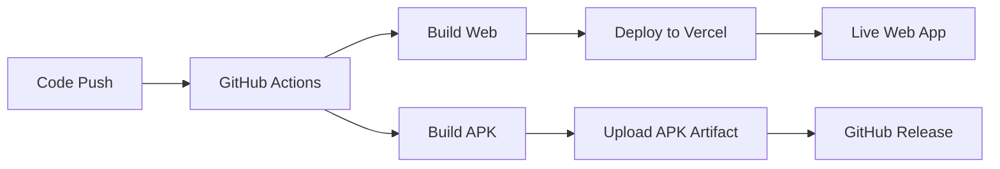

# Young Eagles APK & Web Deployment Guide

## 🚀 Overview

This guide covers three deployment methods for the Young Eagles School Management app:
1. **Web/PWA Deployment** to Vercel (Immediate)
2. **APK Building** via GitHub Actions (Automated)
3. **Local APK Building** (Manual)

---

## 📱 APK Deployment Options

### Option A: GitHub Actions CI/CD (Recommended)

**Advantages:**
- ✅ Automated builds on every push
- ✅ Consistent environment
- ✅ No local Android SDK setup required
- ✅ Automatic release generation
- ✅ APK artifacts stored in GitHub

**Setup Steps:**

1. **Push code to GitHub** (covered below)
2. **Enable GitHub Actions** in your repository settings
3. **Manual APK build trigger:**
   - Go to Actions tab in GitHub
   - Select "Build APK" workflow
   - Click "Run workflow"
   - Choose debug or release build

**What it does:**
- Automatically builds APK on code push
- Creates downloadable artifacts
- Generates GitHub releases for main branch
- Supports both debug and release builds

---

### Option B: Local Android Studio Setup

**Requirements:**
1. Install Android Studio
2. Install Android SDK Platform 33+
3. Accept Android licenses
4. Set ANDROID_HOME environment variable

**Commands:**
```bash
# Build web app
npm run build:prod

# Sync with Android
npx cap sync android

# Open in Android Studio
npx cap open android

# Or build via command line
cd android
./gradlew assembleDebug     # For debug build
./gradlew assembleRelease   # For release build
```

---

### Option C: Online Build Services

**Alternatives:**
- **Ionic Appflow**: Cloud-based builds
- **EAS Build** (Expo): For React Native projects
- **Bitrise**: CI/CD with Android builds
- **CircleCI**: Custom Android build environment

---

## 🌐 Web/PWA Deployment to Vercel

### Manual Deployment

1. **Install Vercel CLI:**
   ```bash
   npm install -g vercel
   ```

2. **Login to Vercel:**
   ```bash
   vercel login
   ```

3. **Deploy:**
   ```bash
   npm run build:prod
   vercel --prod
   ```

### Automated Deployment (via GitHub)

1. **Connect GitHub to Vercel:**
   - Visit [vercel.com](https://vercel.com)
   - Import your GitHub repository
   - Configure build settings:
     - Build Command: `npm run build:prod`
     - Output Directory: `dist`
     - Install Command: `npm ci`

2. **Environment Variables:**
   Set in Vercel dashboard:
   ```
   VITE_API_URL=https://youngeagles-api-server.up.railway.app
   NODE_ENV=production
   ```

---

## 🔧 GitHub Secrets Setup

For automated deployments, add these secrets in GitHub repository settings:

### For Vercel Deployment:
```
VERCEL_TOKEN=your_vercel_token
VERCEL_ORG_ID=your_organization_id
VERCEL_PROJECT_ID=your_project_id
```

### For APK Signing (Release builds):
```
KEYSTORE_FILE=base64_encoded_keystore
KEYSTORE_PASSWORD=your_keystore_password
KEY_ALIAS=your_key_alias
KEY_PASSWORD=your_key_password
```

---

## 📦 Build Outputs

### Web/PWA Build:
- **Location**: `dist/` folder
- **Files**: HTML, CSS, JS, service worker
- **Features**: PWA, offline support, push notifications

### APK Build:
- **Debug**: `android/app/build/outputs/apk/debug/app-debug.apk`
- **Release**: `android/app/build/outputs/apk/release/app-release.apk`
- **Size**: ~10-20MB (depending on assets)

---

## 🧪 Testing

### Web/PWA Testing:
```bash
# Local development
npm run dev

# Production build testing
npm run build:prod
npm run preview
```

### APK Testing:
1. **Install on device**: Enable "Unknown sources" in Android settings
2. **ADB install**: `adb install app-debug.apk`
3. **Testing tools**: Firebase Test Lab, BrowserStack

---

## 🚨 Troubleshooting

### Common APK Build Issues:
1. **Android SDK not found**: Ensure ANDROID_HOME is set
2. **License not accepted**: Run `sdkmanager --licenses`
3. **Gradle build fails**: Check Java version (use Java 17)
4. **Memory issues**: Increase Gradle heap size

### Web Deployment Issues:
1. **Build fails**: Check environment variables
2. **API calls fail**: Verify CORS settings
3. **PWA not installing**: Check manifest.json
4. **Service worker errors**: Clear browser cache

---

## 📋 Deployment Checklist

### Before Deployment:
- [ ] Test all login flows (parent, teacher, admin)
- [ ] Verify mobile responsiveness
- [ ] Test PWA installation
- [ ] Check API endpoints
- [ ] Update version numbers
- [ ] Test push notifications

### After Deployment:
- [ ] Smoke test all major features
- [ ] Verify environment-specific configs
- [ ] Test on multiple devices/browsers
- [ ] Monitor error logs
- [ ] Update documentation

---

## 🔄 Continuous Integration Flow



---

## 📞 Support

For deployment issues:
1. Check GitHub Actions logs
2. Review Vercel deployment logs
3. Test locally first
4. Check this documentation
5. Contact development team

